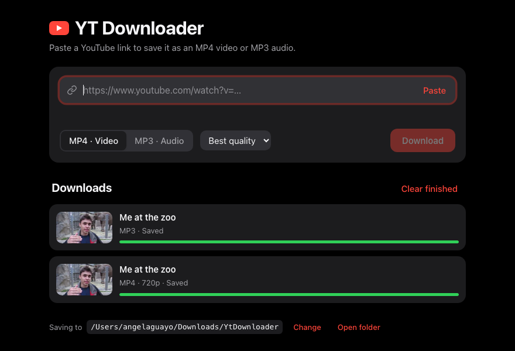

# YT Downloader

Save YouTube videos as **MP4** or their audio as **MP3**, with a simple desktop app or from the command line. Paste a link, pick MP4 or MP3, and it downloads with a live progress bar. It handles single videos, Shorts and whole playlists.



Built on [yt-dlp](https://github.com/yt-dlp/yt-dlp), the open-source engine that keeps up with YouTube's changes.

> **Use it responsibly.** Only download videos you have the right to: your own uploads, Creative Commons content, or anything the owner allows. YouTube's Terms of Service restrict downloading other content.

## Download (Windows)

Go to [**Releases**](../../releases/latest), download **`YTDownloader.exe`**, and double-click it. That's the whole install: ffmpeg and everything else it needs is packed inside the file (which is why it's about 100 MB).

The app isn't code-signed, so Windows SmartScreen may warn the first time. Click **More info → Run anyway**.

## Run from source

You need:
1. **Python 3.10 or newer.** Current yt-dlp no longer supports 3.9.
2. That's it. YouTube now requires solving a JavaScript challenge before it serves a video, and the requirements include the official Deno runtime for that, installed through pip.

Then:

```bash
pip install -r requirements.txt
```

That installs yt-dlp, Deno, a bundled copy of **ffmpeg** (through `imageio-ffmpeg`) and pywebview for the app window.

## The app

```bash
python3 gui.py              # opens the app window
python3 gui.py --browser    # same app, in your browser
```

1. Paste a link. The app shows the video's title, channel and length, or how many videos a playlist has.
2. Choose **MP4 · Video** (and a max quality: best, 4K, 1440p, 1080p, 720p, 480p or 360p) or **MP3 · Audio**.
3. Press **Download**. Downloads run one after another, each with progress, speed and time left.

Files go to `Downloads/YtDownloader` in your home folder. Use **Change** to pick another folder, or **Open folder** to see your files. The app follows your system's light or dark mode.

## Command line

```bash
python3 ytdl.py "https://www.youtube.com/watch?v=jNQXAC9IVRw"           # MP4, best quality
python3 ytdl.py URL --quality 720                                          # MP4, at most 720p
python3 ytdl.py URL --mp3                                                  # MP3 audio
python3 ytdl.py URL1 URL2 -o ~/Music                                       # several, into a folder
python3 ytdl.py "https://www.youtube.com/playlist?list=..."                # a whole playlist
python3 ytdl.py "https://www.youtube.com/watch?v=...&list=..." --no-playlist   # just that one video
python3 ytdl.py --help
```

Files are named `Title [video id].ext`. The id keeps two videos with the same title from overwriting each other.

## How it works

- **MP4:** for anything above 720p, YouTube serves video and audio as separate streams. The tool downloads the best of each within your quality limit and uses ffmpeg to merge them into one `.mp4`. It prefers H.264 video and AAC audio, so the file plays in any player, including Windows' built-in one. YouTube offers those up to 1080p; 1440p and 4K come as VP9/AV1.
- **MP3:** the best audio stream, converted to a 192 kbps MP3.
- **Without ffmpeg** (if `imageio-ffmpeg` can't install on your system), video falls back to single-file formats, usually 720p at most, and audio stays M4A. The app shows a notice when this happens.
- **Errors:** yt-dlp's messages are captured and shown in plain words, like *This video is unavailable*. In a playlist, one broken video doesn't stop the rest.
- **App:** `gui.py` runs a small web server on your computer only (127.0.0.1) and shows `web/index.html` in a native window, the same setup as my [Local Music Events](https://github.com/Afaguayo/local-music-events) app. Requests that change anything need a custom header that browsers won't let other websites send, so no website can start a download through the app.

## Building the .exe

```bash
pip install -r requirements.txt pyinstaller
python build.py        # dist/YTDownloader.exe on Windows (dist/YTDownloader.app on macOS)
```

`build.py` copies ffmpeg and Deno into the build. GitHub Actions builds the `.exe` on every push, checks it with `YTDownloader.exe --selftest report.txt` (confirming the interface, yt-dlp, ffmpeg and Deno are all inside), and attaches it to a release when a `v*` tag is pushed.

## Tests

```bash
python3 -m unittest -v              # offline: fake downloader, no network
LIVE=1 python3 -m unittest -v       # also downloads the first YouTube video ever (19 s) as MP3 and MP4
```
